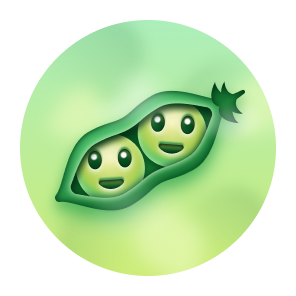

<!-- Header Typing Banner -->
<p align="center">
  
</p>

<!-- Value Pillars / Status Badges -->
<p align="center">
  <a href="https://linkedin.com/in/016anuragpareek"></a>
  <a href="mailto:contact.anuragpareek@gmail.com"></a>
  <a href="https://kaggle.com"></a>
  
  
</p>

---

## 🙋‍♂️ About Me

I am an **Engineer transitioning toward high-quality Data Analytics and Data Science work**. I blend a strong engineering foundation (clean code, systems architecture, optimization) with an analytical mindset to process messy datasets, design robust SQL database views, build end-to-end Python data pipelines, and design interactive dashboards. I am passionate about uncovering insights, discovering statistical patterns, and translating complex data into strategic business recommendations.

* **Analytical Philosophy:** Data is only as useful as the actions it inspires. Good analytics requires both technical rigor and clear storytelling.
* **Engineering Standard:** Well-structured schemas, optimized queries, automated cleaning pipelines, and reproducible notebooks.

---

## 🔥 Current Focus

- 📈 **Advanced SQL:** Mastering analytical window functions, CTEs, self-joins, and query execution optimizations.
- 📊 **Hypothesis Testing:** Strengthening inferential statistics, probability modeling, and A/B testing methodologies.
- 🎨 **Business Dashboards:** Building interactive storyboards and visual reports using Power BI and Tableau.
- 🧪 **Machine Learning:** Exploring supervised algorithms, feature engineering, and predictive evaluation metrics.
- 💼 **Analytical Case Studies:** Working through customer retention, churn modeling, and marketing spend attribution scenarios.

---

## 🛠️ Tech Stack & Analytical Toolchain

```text
Languages:    Python, SQL, Excel
Libraries:    Pandas, NumPy, Matplotlib, Seaborn, Plotly, SciPy, Statsmodels, Scikit-Learn
BI Tools:     Power BI, Tableau
Tools/Infra:  Jupyter Notebook, Git, GitHub Actions, PostgreSQL, BigQuery, Docker
```

<p align="left">
  <a href="https://skillicons.dev">
    
  </a>
</p>

---

## 🏆 Kaggle Progress
I actively participate in structured data competitions and notebook development to refine my predictive modeling and feature engineering skill sets:
- **Focus Areas:** Supervised predictive modeling, outlier treatment, feature scaling, cross-validation tuning.
- **Tools Used:** Jupyter Notebooks, Scikit-Learn, XGBoost, Pandas.

---

## 📊 Analytics Journey & Portfolios

I maintain active repositories tracking my implementations of data analytics, visualization, and platform development:

| Repository / Project | Description | Primary Stack |
| :--- | :--- | :--- |
| **[Fintura](https://github.com/krsna016/fintura)** | Production-grade transaction intelligence platform parsing bank statement ledgers. | FastAPI • Next.js • SQL |
| **[Data Science Workflows](https://github.com/krsna016/data-science-ineuron-2025-v2)** | End-to-end exploratory analysis pipelines, outliers treatment, and notebooks. | Python • Pandas • Jupyter |
| **[Data Science Learning](https://github.com/krsna016/data-science-cwh-2025-v2)** | Implementations of statistical models and exploratory data profiling. | Python • Scikit-Learn |
| **[Data Visualization](https://github.com/krsna016/python-data-visualization-libraries-2025-v1)** | Visualizing statistical distributions, correlations, and geospatial datasets. | Seaborn • Plotly • Matplotlib |
| **[Data Foundations](https://github.com/krsna016/python-learning-ineuron-2025-v1)** | Assignments, notebooks, and coding structures focused on statistical modeling. | Python • NumPy • SciPy |

---

## 🎯 Goals for 2026

- [ ] **Data Analytics Readiness:** Complete a portfolio of production-ready analytical pipelines.
- [ ] **SQL Mastery:** Solve 100+ complex query tasks on SQL practice platforms.
- [ ] **Portfolio Projects:** Build and publish 20+ analytical projects and dashboard case studies.
- [ ] **Kaggle Competition:** Secure a competitive rank in a tabular data predictive competition.
- [ ] **Open-Source Data:** Contribute performance optimizations or documentations to open-source data libraries.

---

## 📖 Recommended Reading List

- 📖 **Storytelling with Data** by Cole Nussbaumer Knaflic *(Visual communication & design)*
- 📖 **Naked Statistics** by Charles Wheelan *(Intuitive explanation of statistical inference)*
- 📖 **Designing Data-Intensive Applications** by Martin Kleppmann *(Data structures, storage, query execution)*

---

## 📝 Selected Articles

- 📝 *Uncovering Business Growth: Cohort Analysis and User Retention Dynamics* (Published on Dev.to)
- 📝 *SQL Query Optimization: Fine-Tuning Queries for Business Intelligence* (Published on Medium)
- 📝 *Outlier Detection & Imputation: Data Cleaning Recipes in Python* (Published on Hashnode)

---

## 🏆 Certifications

- 🎖️ **AWS Certified Solutions Architect – Professional** (ID: AWS-SAP-7489)
- 🎖️ **Google Cloud Professional Cloud Architect** (ID: GCP-PCA-1102)
- 🎖️ **Certified Kubernetes Administrator (CKA)** (ID: CNCF-CKA-9981)

---

## 🎖️ GitHub Achievements & Badges Showcase

<div align="center">
  <table border="0" cellpadding="15">
    <tr>
      <td align="center" valign="top" width="240">
        <br />
        
        <br /><br />
        <strong>🏆 Pull Shark (Bronze x2)</strong>
        <br />
        <font size="2" color="#f9d042"><b>Active • Level Up in Progress</b></font>
        <br />
        <code>██░░░░░░░░░░░░░░░░░░</code>
        <br />
        <font size="2" color="#888888">24 / 128 PRs to Silver Tier</font>
      </td>
      <td align="center" valign="top" width="240">
        <br />
        
        <br /><br />
        <strong>⚡ Quickdraw</strong>
        <br />
        <font size="2" color="#46c183"><b>Active • Fully Mastered</b></font>
        <br />
        <code>████████████████████</code>
        <br />
        <font size="2" color="#888888">PR closed in under 5 minutes</font>
      </td>
    </tr>
  </table>
</div>

<details>
  <summary><b>🎯 Show Achievement Roadmap & Locked Badges</b></summary>
  <br />
  <div align="center">
    <table border="0" cellpadding="10">
      <tr>
        <td align="center" valign="top" width="160">
          
          <br /><br />
          <strong>YOLO</strong>
          <br />
          <font size="2" color="#888888">Self-merge a PR without review</font>
        </td>
        <td align="center" valign="top" width="160">
          
          <br /><br />
          <strong>Pair Extraordinaire</strong>
          <br />
          <font size="2" color="#888888">Co-author a commit with a peer</font>
        </td>
        <td align="center" valign="top" width="160">
          
          <br /><br />
          <strong>Galaxy Brain</strong>
          <br />
          <font size="2" color="#888888">2 accepted discussion answers</font>
        </td>
        <td align="center" valign="top" width="160">
          
          <br /><br />
          <strong>Starstruck</strong>
          <br />
          <font size="2" color="#888888">Receive 16 stars on repositories</font>
        </td>
      </tr>
    </table>
  </div>
</details>

---

## 📈 GitHub Statistics & Analytics

<p align="center">
  
  
</p>

<p align="center">
  
</p>

<!-- Snake Contribution Animation -->
<p align="center">
  
</p>

---

## 📬 Contact & Support
- **Corporate Inquiries:** `contact.anuragpareek@gmail.com`
- **LinkedIn:** [linkedin.com/in/016anuragpareek](https://linkedin.com/in/016anuragpareek)

---

## 💖 Support Section
If you find my analytical toolkits or case studies helpful, consider supporting my work:
- ☕ **Buy Me A Coffee:** [buymeacoffee.com/krsna016](https://buymeacoffee.com/krsna016)
- 💖 **GitHub Sponsors:** Sponsor my profile directly via the GitHub Sponsor program.

---
<p align="center">
  <sub>All repositories follow security best practices. No credentials, tokens, or private endpoints are exposed.</sub>
</p>
